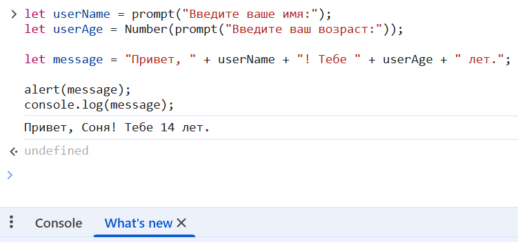
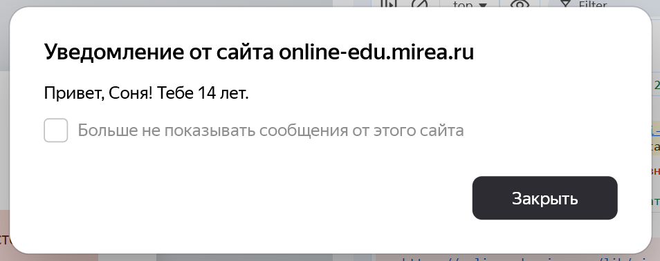

|||
|---|---|
|ДПО|Фронтенд и бэкенд разработка|
|ДИСЦИПЛИНА|Основы фронтенд-разработки|
|ВИД УЧЕБНОГО МАТЕРИАЛА|Методические указания к практическим занятиям|

---

### **Практическое занятие 9:  JavaScript (работа в консоли браузера)**

### **Цель:**
Закрепить базовые конструкции языка JavaScript: переменные, типы данных, диалоговые окна, преобразование типов, математические операции, операторы сравнения, условное ветвление, логические операторы, циклы и функции.

---

### **Теоретическая справка**

#### **1. Переменные**
Для хранения данных используются ключевые слова:
- `let` – переменная, значение которой может изменяться.
- `const` – константа, значение не может быть переопределено.
- `var` – устаревший способ, не рекомендуется к использованию.

```javascript
let userName = "Иван";
const BIRTH_YEAR = 2000;
```

#### **2. Типы данных**
- `number` – числа (целые, дробные)
- `string` – строки (текст)
- `boolean` – логический тип (`true` / `false`)
- `undefined` – значение не присвоено
- `null` – «ничего», пусто
- `object` – объекты, массивы

```javascript
let age = 25;           // number
let name = "Анна";      // string
let isStudent = true;   // boolean
```

#### **3. Диалоговые окна**
- `alert(message)` – модальное окно с сообщением
- `prompt(label)` – окно с полем ввода, возвращает **строку**
- `confirm(question)` – окно с подтверждением, возвращает `true`/`false`

```javascript
let name = prompt("Введите имя:");
alert("Привет, " + name);
```

#### **4. Преобразование типов**
- `Number(value)` – преобразует в число
- `String(value)` – преобразует в строку
- `Boolean(value)` – преобразует в логическое значение

```javascript
let age = Number(prompt("Сколько лет?"));  // строка → число
```

#### **5. Базовые математические операции**
`+`, `-`, `*`, `/`, `%` (остаток от деления), `**` (возведение в степень)

#### **6. Операторы сравнения**
`>`, `<`, `>=`, `<=`, `===` (строгое равенство), `!==` (строгое неравенство)

#### **7. Условное ветвление**
```javascript
if (условие) {
    // действие
} else if (другое условие) {
    // другое действие
} else {
    // иначе
}
```

#### **8. Логические операторы**
- `&&` – И (все условия истинны)
- `||` – ИЛИ (хотя бы одно истинно)
- `!` – НЕ (инверсия)

#### **9. Циклы**
```javascript
// while
while (условие) {
    // тело цикла
}

// for
for (let i = 0; i < 5; i++) {
    // тело цикла
}
```

#### **10. Функции**
```javascript
function имя(параметры) {
    // тело функции
    return результат;
}
```

#### **11. Вывод в консоль**
- `console.log()` – информационное сообщение
- `console.error()` – ошибка
- `console.warn()` – предупреждение
- `console.table()` – табличное представление

---

### **Задания для выполнения (работа в консоли браузера)**

---

#### **Задание 1. Приветствие пользователя**

**Условие:**
1. Запросите у пользователя имя с помощью `prompt()`.
2. Запросите у пользователя возраст.
3. Выведите в `alert()` сообщение: «Привет, [имя]! Тебе [возраст] лет.».
4. Выведите эту же информацию в консоль.

---

**Пример оформления**

```javascript
// Задание: Приветствие
// 1. Запросить имя и возраст
// 2. Вывести приветствие в alert и в консоль

let userName = prompt("Введите ваше имя:");
let userAge = Number(prompt("Введите ваш возраст:"));

let message = "Привет, " + userName + "! Тебе " + userAge + " лет.";

alert(message);
console.log(message);
```

*Скриншот: консоль браузера с выводом сообщения*




*Скриншот: alert с выводом*



---

#### **Задание 2. Проверка совершеннолетия**

**Условие:**
1. Используйте код из Задания 1.
2. Добавьте проверку: если возраст пользователя 18 или более лет, выведите в `alert()` и в консоль сообщение «Вы совершеннолетний». Иначе — «Вы несовершеннолетний».
3. Проверку реализуйте через `if else`.

---

#### **Задание 3. Угадай число**

**Условие:**
1. Сгенерируйте случайное целое число от 1 до 10 с помощью `Math.random()` и `Math.floor()`.
2. Запросите у пользователя число с помощью `prompt()`.
3. Реализуйте цикл, который позволяет угадывать число до тех пор, пока пользователь не даст правильный ответ или не нажмёт «Отмена».
4. Если не угадал, выведите сообщение с подсказкой: «Загаданное число больше» или «Загаданное число меньше».
5. Если пользователь угадал число, выведите «Поздравляем! Вы угадали число!».

---

#### **Задание 4. Проверка пароля**

**Условие:**
1. Задайте в коде константу с правильным паролем (например, `"12345"`).
2. Запросите у пользователя пароль с помощью `prompt()`.
3. Если введённый пароль совпадает с правильным, выведите «Доступ разрешен».
4. Если не совпадает, выведите «Доступ запрещен».
5. Добавьте проверку на пустую строку или отмену ввода. Если пользователь ничего не ввёл, выведите сообщение «Пароль не введён».

---

#### **Задание 5. Простой калькулятор**

**Условие:**
1. Запросите у пользователя первое число.
2. Запросите второе число.
3. Запросите оператор (`+`, `-`, `*`, `/`).
4. Выполните соответствующее арифметическое действие.
5. Выведите результат в `alert()` и в консоль.
6. Если введён неверный оператор, выведите сообщение «Неверный оператор».
7. При делении на ноль выведите сообщение «На ноль делить нельзя».

**Требования:**
- Обязательно выполните преобразование строк в числа.
- Используйте `if else` или `switch` для выбора операции.

---

### **Формат сдачи**

1. Открыть консоль браузера (F12 → вкладка Console).
2. Выполнить/протестированть решение каждого задания, убедиться в его работоспособности.
3. Сделать скриншоты консоли с кодом и результатом выполнения для каждого задания. Сохранить в формате .pdf.
4. Приложить итоговый файл в область для загрузки.

---

### **Полезные материалы**

1. MDN Web Docs — JavaScript [Полное руководство по JavaScript](https://developer.mozilla.org/ru/docs/Web/JavaScript)
2. [JS-tutorial](https://github.com/dv0retsky/js-tutorial)
