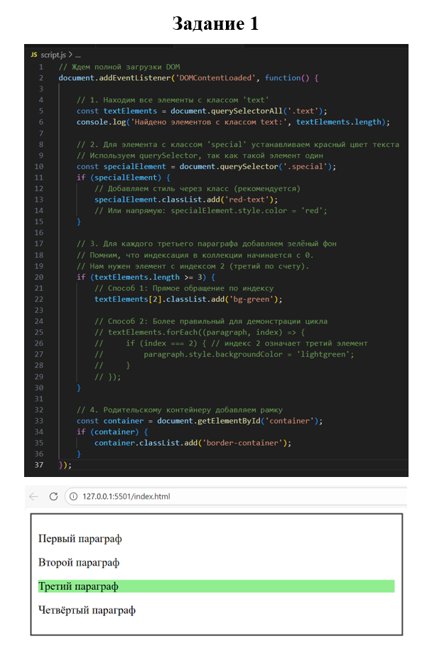

|||
|---|---|
|ДПО|Фронтенд и бэкенд разработка|
|ДИСЦИПЛИНА|Основы фронтенд-разработки|
|ВИД УЧЕБНОГО МАТЕРИАЛА|Методические указания к практическим занятиям|

## **Практическое занятие 11: Манипуляции с DOM и навигация по элементам**

---

### **Цель:**
Научиться создавать, изменять и удалять элементы DOM, навигировать по дереву документа, использовать data-атрибуты и применять стили через классы. Закрепить навыки поиска элементов и обработки событий для создания интерактивных интерфейсов.

---

### **Теоретическая справка**

#### **1. Поиск элементов в DOM**
Прежде чем что-то менять, элемент нужно найти.

```javascript
// Поиск одного элемента (возвращает первый найденный)
const container = document.getElementById('container');
const specialElement = document.querySelector('.special'); // CSS-селектор

// Поиск всех подходящих элементов (возвращает коллекцию NodeList)
const allTextElements = document.querySelectorAll('.text');
const allItems = document.getElementsByClassName('item'); // устаревший, но рабочий метод
```

#### **2. Навигация по DOM (перемещение между узлами)**
Зная элемент, можно переместиться к соседям, родителям или детям.

```javascript
const currentElement = document.querySelector('.special');

// Родитель
const parent = currentElement.parentNode; // или parentElement

// Дочерние элементы (только теги)
const children = parent.children; // HTMLCollection

// Соседи
const next = currentElement.nextElementSibling; // следующий элемент
const prev = currentElement.previousElementSibling; // предыдущий элемент

// Поиск среди всех потомков конкретного элемента
const nestedParagraph = parent.querySelector('p'); // ищет только внутри parent
```

#### **3. Создание и вставка элементов**
```javascript
// Создание
const newLi = document.createElement('li');
newLi.textContent = 'Новый пользователь';

// Вставка в конец списка
const list = document.getElementById('userList');
list.appendChild(newLi);

// Вставка в определенное место (например, в начало)
const firstLi = list.firstElementChild;
list.insertBefore(newLi, firstLi);

// Более современный способ
list.append(newLi); // в конец
list.prepend(newLi); // в начало
```

#### **4. Работа с атрибутами и data-атрибутами**
```javascript
// Классы
element.classList.add('highlight');
element.classList.remove('text');
element.classList.toggle('active'); // добавит, если нет; удалит, если есть

// Стили (лучше менять через классы, но можно и напрямую)
element.style.color = 'red';
element.style.backgroundColor = 'green';

// Дата-атрибуты
const price = element.dataset.price; // получаем значение data-price
console.log(Number(price)); // не забываем преобразовывать в число
```

#### **5. Обработка событий для динамических элементов**
```javascript
button.addEventListener('click', function() {
    // Логика добавления нового элемента
    const newItem = document.createElement('li');
    newItem.textContent = 'Новый пользователь';
    list.appendChild(newItem);
});
```

---

### **Пример выполнения работы**

Рассмотрим аналогичную задачу:

#### **Условие:**
На странице есть контейнер `div` с параграфами. Нужно:
1. Найти все параграфы с классом `text`.
2. Третьему параграфу задать зеленый фон.
3. Родительскому контейнеру добавить рамку.

#### **Шаг 1: HTML-структура (основа)**
```html
<!DOCTYPE html>
<html lang="ru">
<head>
    <meta charset="UTF-8">
    <title>Практика DOM</title>
    <style>
        .border-container { border: 2px solid #333; padding: 10px; }
        .bg-green { background-color: lightgreen; }
    </style>
</head>
<body>
    <div id="container">
        <p class="text">Первый параграф</p>
        <p class="text special">Второй параграф</p>
        <p class="text">Третий параграф</p>
        <p class="text">Четвёртый параграф</p>
    </div>

    <script src="script.js"></script>
</body>
</html>
```

#### **Шаг 2: Реализация логики (script.js)**
```javascript
// Ждем полной загрузки DOM
document.addEventListener('DOMContentLoaded', function() {
    
    // 1. Находим все элементы с классом 'text'
    const textElements = document.querySelectorAll('.text');
    console.log('Найдено элементов с классом text:', textElements.length);
    
    // 2. Для элемента с классом 'special' устанавливаем красный цвет текста
    // Используем querySelector, так как такой элемент один
    const specialElement = document.querySelector('.special');
    if (specialElement) {
        // Добавляем стиль через класс (рекомендуется)
        specialElement.classList.add('red-text');
        // Или напрямую: specialElement.style.color = 'red';
    }
    
    // 3. Для каждого третьего параграфа добавляем зелёный фон
    // Помним, что индексация в коллекции начинается с 0.
    // Нам нужен элемент с индексом 2 (третий по счету).
    if (textElements.length >= 3) {
        // Способ 1: Прямое обращение по индексу
        textElements[2].classList.add('bg-green');
        
        // Способ 2: Более правильный для демонстрации цикла
        // textElements.forEach((paragraph, index) => {
        //     if (index === 2) { // индекс 2 означает третий элемент
        //         paragraph.style.backgroundColor = 'lightgreen';
        //     }
        // });
    }
    
    // 4. Родительскому контейнеру добавляем рамку
    const container = document.getElementById('container');
    if (container) {
        container.classList.add('border-container');
    }
});
```

---

### **Задания для самостоятельного выполнения**

#### Задание №1: Генерация списка
Создайте через JavaScript структуру элементов и добавьте её на страницу:

1. Создайте заголовок `h1` с текстом "Список пользователей".
2. Создайте маркированный список `ul` с 3 элементами `li`: "Анна", "Борис", "Виктор".
3. Создайте кнопку "Добавить пользователя".
4. Реализуйте функционал: при клике на кнопку в список добавляется новый элемент `li` с текстом "Новый пользователь".
5. Используйте методы `createElement()`, `appendChild()`, `textContent`.

#### Задание №2: Работа с селекторами
Для приведённой HTML-структуры напишите код, который:

1. Находит все элементы с классом `text`.
2. Для элемента с классом `special` устанавливает красный цвет текста.
3. Для каждого **третьего** параграфа (относительно общего списка) добавляет зелёный фон.
4. Родительскому контейнеру добавляет рамку.

```html
<div id="container">
  <p class="text">Первый параграф</p>
  <p class="text special">Второй параграф</p>
  <p class="text">Третий параграф</p>
  <p class="text">Четвёртый параграф</p>
</div>
```

#### Задание №3: Data-атрибуты и вычисления
Для приведённой HTML-структуры напишите код, который:

1. Находит все элементы с классом `item`.
2. Для **активного** элемента (с классом `active`) добавляет класс `highlight` (заранее создайте этот класс в CSS, например, `highlight { background-color: yellow; }`).
3. Вычисляет **суммарную стоимость** всех товаров на основе `data-атрибутов`.
4. Находит товар с **максимальной ценой** и выводит его название в консоль.

```html
<div class="item" data-price="100">Товар 1</div>
<div class="item active" data-price="200">Товар 2</div>
<div class="item" data-price="150">Товар 3</div>
```

---


### **Формат отчёта**

1. Выполнить/протестированть решение каждого задания, убедиться в его работоспособности.
2. Сделать скриншоты кода и полученного результата для каждого задания. Сохранить в формате .pdf.
3. Приложить итоговый файл в область для загрузки.

*Скриншот: пример ответа на задание*

