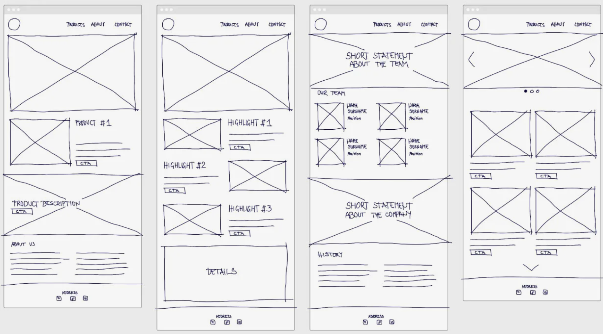

|||
|---|---|
|ДПО|Фронтенд и бэкенд разработка|
|ДИСЦИПЛИНА|Основы фронтенд-разработки|
|ВИД УЧЕБНОГО МАТЕРИАЛА|Методические указания к практическим занятиям|

---

### **Практическое занятие 7: Работа с CSS-фреймворками 1**

---

### **Цель:**  
Научиться проектировать структуру веб-проекта и создавать чистый, минималистичный лендинг с использованием современных CSS-фреймворков. Закрепить навыки работы с инструментами визуального проектирования и компонентным подходом в вёрстке.

---

### **Введение и теоретическая база**

Перед выполнением практики ознакомьтесь с материалами Лекций 6 и 7

---

### **Последовательность выполнения работы**

#### **Шаг 1: Выбор темы и проектирование карты сайта**

1. Выберите тематику работы (аналогично формату, представленному в Практическом занятии 6). Еще несколько примеров тем:
   - Сервис доставки здорового питания
   - Приложение для медитации
   - Онлайн-курс по программированию
   - Эко-магазин
   - Портфолио дизайнера

2. Создайте карту сайта в формате Mind Map. Можно использовать сервис **BoardMix** или аналогичном сервисте (Miro, FigJam и другие).
   - Определите основные страницы и разделы.
   - Продумайте навигацию и связи между страницами.
   - Укажите ключевые блоки на каждой странице (хедер, герой, преимущества, отзывы, футер и т.д.).

3. Сохраните карту сайта как изображение и добавьте в отчет.

Примеры карт сайта представлен в Лекции 6.

Примеры макетов лендингов, на которые можно ориентироваться:


---

#### **Шаг 2: Выбор CSS-фреймворка**

Выберите один из фреймворков, рассмотренных на Лекции 7:

- 19-21 Bootstrap
- 22-25 Bulma
- 26-28 Foundation
- 29-31 Fomantic UI 
- 32-34 Blaze UI 
- 35-37 Vanilla Framework
- 40-43 Tailwind
- 44-47 Open Props 
- 48-50 Tachyons
- 51-53 Materialize
- 56-59 Pure
- 60-62 Miligram
- 63-65 Chota
- 66-69 Spectre
- 70-73 Skeleton
- 76-78 Water
- 79-81 MVP
- 84-88 UIKit

---

#### **Шаг 3: Настройка проекта и подключение фреймворка**

1. Работу рекомендуется начать в новом репозитории.
2. Инициализируйте HTML-структуру.
3. Подключите выбранный CSS-фреймворк через CDN или локально.

Относительно подключения можно ориентироваться на документацию соответствующих фреймворков (ссылки представлены в Лекции 7)

**Пример для Pure.css (HTML):**

```html
<!DOCTYPE html>
<html lang="ru">
<head>
    <meta charset="UTF-8">
    <meta name="viewport" content="width=device-width, initial-scale=1.0">
    <title>Минималистичный лендинг | Pure.css</title>
    <!-- Pure CSS -->
    <link rel="stylesheet" href="https://cdn.jsdelivr.net/npm/purecss@3.0.0/build/pure-min.css">
    <link rel="stylesheet" href="https://cdn.jsdelivr.net/npm/purecss@3.0.0/build/grids-responsive-min.css">
</head>
<body>
    <!-- Контент -->
</body>
</html>
```

**Пример для Bulma (HTML):**

```html
<!DOCTYPE html>
<html lang="ru">
<head>
    <meta charset="UTF-8">
    <meta name="viewport" content="width=device-width, initial-scale=1.0">
    <title>Минималистичный лендинг | Pure.css</title>
    <!-- Bulma -->
     <link rel="stylesheet" href="https://cdn.jsdelivr.net/npm/bulma@1.0.4/css/bulma.min.css">
    <!-- Подключаем иконки Font Awesome, пригодятся в реализации -->
    <link rel="stylesheet" href="https://cdnjs.cloudflare.com/ajax/libs/font-awesome/6.7.2/css/all.min.css">
</head>
<body>
    <!-- Контент -->
</body>
</html>
```

---

#### **Шаг 4: Создание минималистичного лендинга**

Сверстайте одностраничный лендинг, используя компоненты и сетку выбранного фреймворка. Структура может включать:

1. **Фиксированный хедер** с логотипом и навигацией
2. **Герой-секцию** с заголовком, подзаголовком и кнопкой CTA / это также могут быть рекламные баннеры
3. **Секцию «О проекте»** с текстом и изображением
4. **Сетку карточек** (услуги, преимущества, особенности)
5. **Футер** с контактами и ссылками на соцсети

**Пример Hero-секции на Pure.css:**

```html
<div class="hero pure-g">
    <div class="pure-u-1 pure-u-md-2-3">
        <h1 class="hero-title">Здоровое питание с доставкой</h1>
        <p class="hero-subtitle">Ежедневные рационы от шеф-повара. Без сахара, глютена и консервантов.</p>
        <a href="#order" class="pure-button pure-button-primary">Заказать пробный день</a>
    </div>
    <div class="pure-u-1 pure-u-md-1-3">
        
    </div>
</div>
```

**Пример Hero-секции на Bulma:**

```html
 <section class="hero is-success is-halfheight">
        <div class="hero-body">
            <div class="container has-text-centered">
                <h1 class="title is-1">
                    Превратите идеи в реальность
                </h1>
                <h2 class="subtitle is-4">
                    Мощный инструмент, который помогает вам достигать большего с меньшими усилиями. Просто, быстро,
                    эффективно.
                </h2>
                <div class="buttons is-centered">
                    <a href="#pricing" class="button is-large is-light">
                        <span>Выбрать план</span>
                        <span class="icon">
                            <i class="fas fa-arrow-right"></i>
                        </span>
                    </a>
                    <a href="#how-it-works" class="button is-large is-outlined is-light">
                        <span class="icon">
                            <i class="fas fa-play"></i>
                        </span>
                        <span>Смотреть видео</span>
                    </a>
                </div>
            </div>
        </div>
    </section>
```

---

#### **Шаг 5: Адаптивность и доступность**

1. Протестируйте навигацию с клавиатуры (Tab, Enter).

---

#### **Шаг 6: Публикация и документирование**

1. Зафиксируйте изменения в Git
2. Опубликуйте на GitHub Pages.
3. Добавьте в `README.md`:
   - Тему проекта
   - Название использованного фреймворка

---

### **Формат отчёта**

В область для загрузки необходимо прикрепить:
- Ссылку на GitHub Pages
- Проработанную стуктуру сайта (карта сайта) в формате скриншота

---

### **Чек-лист самопроверки**

[ ] Карта сайта создана и отражает структуру проекта  
[ ] Лендинг свёрстан на выбранном CSS-фреймворке  
[ ] Дизайн минималистичный, без визуального шума  
[ ] Есть CTA-кнопки с понятными призывами  
[ ] Код проходит валидацию (HTML/CSS)  
[ ] Футер содержит контакты/соцсети  
